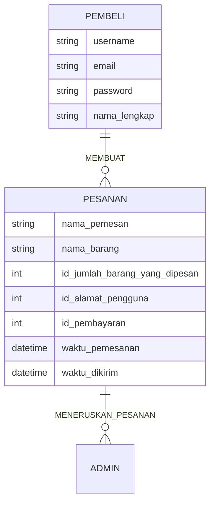

## 1.1 Latar Belakang

Sekarang zamannya e commerce maka banyak orang memakai toko online untuk menjual dan membeli sesuatu, maka saya ingin mendigitalkan agar orang tidak perlu ke toko untuk membeli sesuatu. Cukup dengan dirumah saja.

## 1.2. Deksripsi Teknologi Informasi

Website ini sangat sederhana, dimana pembeli dapat membeli makanan berupa roti, pastry, kue, dan lain-lain.

## 1.3. Branding

Merk : Cita Sari
Tagline : pembelian mudah untuk makanan
Campaign : bagaimana agar orang mudah membeli makanan tanpa harus keluar rumah
Target user :
Seseorang yang ingin makanan ringan
Seseorang yang butuh makanan untuk sebuah acara / kegiatan
User experience :
Mudah 
Sederhana

## 2. User Story

bla | bla | bla | bla
---|---|---|---
bla | bla | bla | ⭐⭐⭐⭐⭐

## 3. Struktur Data

## 4. Arsitektur Sistem

Masih pake mermaid.js juga bisa lihat flowchart di [https://mermaid.js.org/syntax/flowchart.html](https://mermaid.js.org/syntax/flowchart.html)

## 5. Teknologi, Library, dan Framework

bla bla bla

## 6. Desain User Experience dan User Interface

https://www.figma.com/file/NhKE5dOSKAlfVYIb1P2k2Z/Figma-basics?type=design&node-id=1669%3A162202&mode=design&t=7olGBrC8d37R33Gi-1

## 7. Demonstrasi Video

Link youtube nya

## 8. Bagaimana mesin komputasi dan sistem operasi berperan dalam produk teknologi informasimu ?

Link youtube nya di detik jawaban ini

## 9. Bagaimana algoritma, struktur data, dan bahasa pemrograman berperan dalam produk teknologi informasimu ?

Link youtube nya di detik jawaban ini

## 10. Bagaimana metode pengembangan perangkat lunak / Software Development Life Cycle berperan dalam produk teknologi informasimu ?

Link youtube nya di detik jawaban ini

## 11. Bagaimana database / sistem basis data berperan dalam produk teknologi informasimu ?

Link youtube nya di detik jawaban ini

